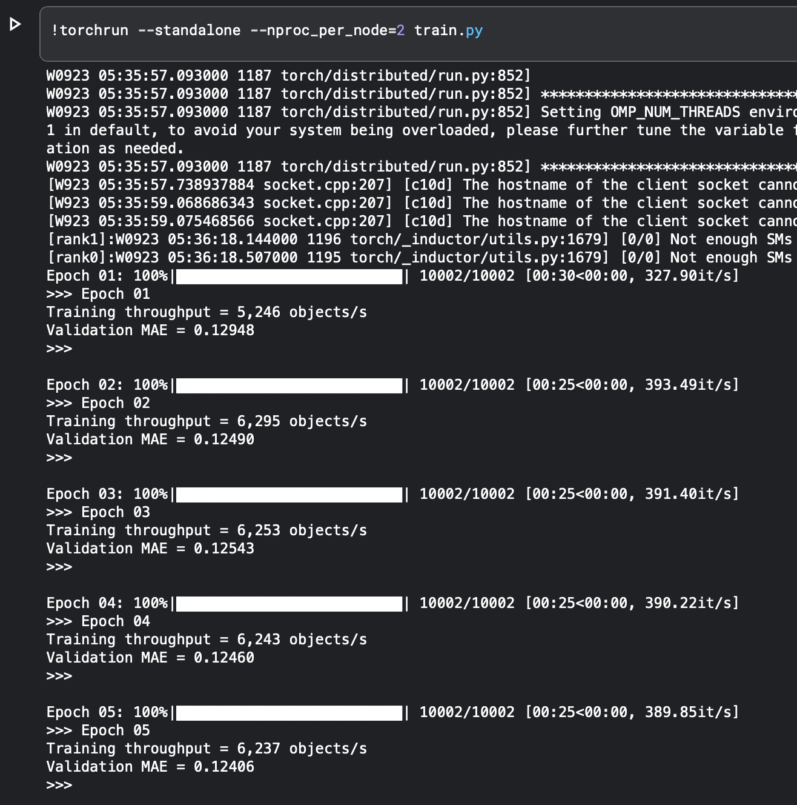
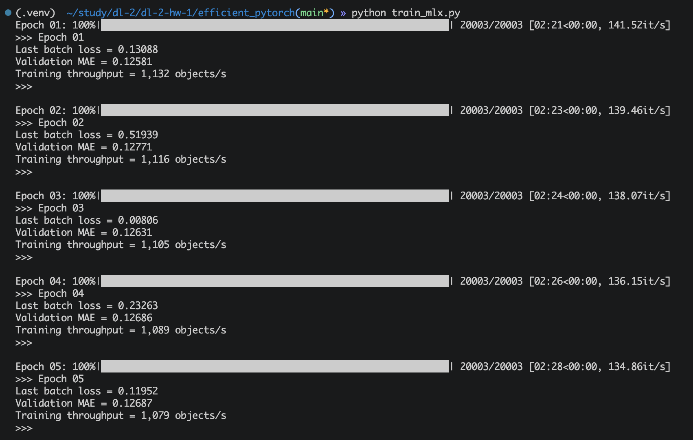

# Отчет по Efficient PyTorch

## Оптимизация PyTorch

Исходная версия модели работала очень медленно из-за большого количества небольших операций и создания крупных промежуточных тензоров.

Главное изменение было сделано в expansion-блоке. В исходной реализации создавался большой промежуточный тензор размерности `[batch, prompts, columns, d_model]`. Так как в этом блоке нет нелинейностей, вычисления удалось алгебраически переписать через матричное умножение и масштабирование, не создавая этот тензор.

Также были внесены следующие изменения:

* убраны лишние `repeat` и `cat`, вместо них используются broadcasting и разбиение весов линейного слоя
* несколько циклов Trompt объединены в batched-тензорные операции
* данные заранее переносятся на GPU, чтобы не копировать каждый batch с CPU
* используется AMP с `float16`
* модель компилируется с помощью `torch.compile`
* используется fused-версия `AdamW`
* обучение распределено между двумя T4: на каждой GPU вычисляется половина из шести независимых циклов модели

В результате скорость обучения на двух T4 составила примерно **6200-6300 objects/s**.

## MLX на MacBook

Модель была перенесена на фреймворк MLX и запущена на Apple Silicon.

Используются те же основные идеи оптимизации: expansion-блок был переписан без большого промежуточного тензора, полный шаг обучения с forward, backward и обновлением AdamW компилируется с помощью `mx.compile`.  

На MacBook скорость составила примерно **1100 objects/s**.

